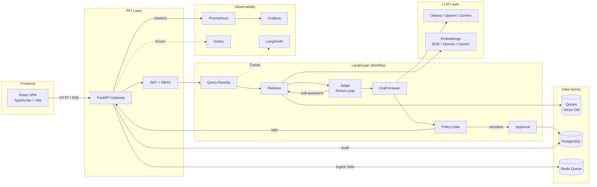
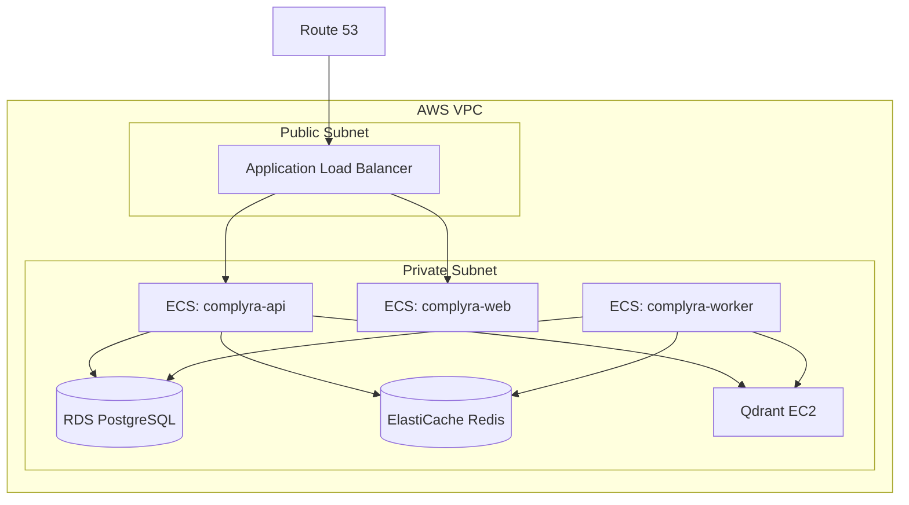

# Complyra

[](https://github.com/weiguangli-io/complyra/actions/workflows/ci.yml)
[](https://www.python.org/downloads/)
[](LICENSE)
[](web/)
[](docker-compose.yml)

> **Complyra** = **Comply** + **RA**(G) — Enterprise compliance knowledge assistant powered by Retrieval-Augmented Generation.

Complyra is a production-ready, multi-tenant enterprise RAG system with human-in-the-loop approval workflow, RBAC, full audit logging, knowledge base management, and cloud deployment automation — built for compliance-sensitive environments.

---

## Why Complyra?

In compliance-critical industries (finance, healthcare, legal), AI-generated answers **cannot** be blindly trusted. Complyra solves this by adding:

- **Approval gates** — Human reviewers approve/reject AI answers before release
- **Output policy guards** — Automatic detection of leaked secrets, credentials, and sensitive patterns
- **Per-document sensitivity controls** — Fine-grained approval rules at the document level
- **Complete audit trail** — Every question, answer, approval, and action is logged and exportable

## Architecture



> See [`docs/workflow-design.md`](docs/workflow-design.md) for the complete workflow state machine and sequence diagrams.

## Features

| Category | Feature | Description |
|----------|---------|-------------|
| **RAG** | Multi-tenant retrieval | Tenant-scoped document ingestion and vector search via `X-Tenant-ID` |
| **RAG** | ReAct retrieval loop | Judge → sub-question → re-retrieve for complex queries |
| **RAG** | Query rewriting | LLM-powered query rewriting for better retrieval |
| **RAG** | Pluggable embeddings | SentenceTransformer (BGE), OpenAI, or Gemini — switchable via config |
| **RAG** | Hybrid search | Dense + sparse vector search for improved recall |
| **Workflow** | Human-in-the-loop approval | LangGraph workflow with configurable approval gates |
| **Workflow** | Approval policy chain | Document override → tenant policy → global setting |
| **Workflow** | Output policy guard | Regex-based detection of secrets, API keys, credentials |
| **Workflow** | SSE streaming | Real-time token-by-token chat via `POST /chat/stream` |
| **KB** | Document management | Upload, sensitivity levels, bulk operations, preview |
| **KB** | Per-document approval override | `always` / `never` / `inherit` per document |
| **KB** | Async ingestion | Redis + RQ worker for background document processing |
| **KB** | OCR support | Tesseract-based OCR for scanned documents and images |
| **Security** | RBAC | Three roles: `admin`, `auditor`, `user` |
| **Security** | Tenant isolation | Row-level and vector-level data isolation |
| **Ops** | Audit trail | Full event logging with search and CSV export |
| **Ops** | LangSmith tracing | Optional LLM observability with zero code overhead |
| **Ops** | Prometheus + Grafana | Custom metrics: query latency, embedding throughput, queue depth |
| **Ops** | Sentry integration | Error tracking and alerting |
| **Infra** | Terraform IaC | AWS infrastructure with OPA policy gate |
| **Infra** | Docker ARM64 | Multi-arch container builds for ECS Fargate |

## Quick Start

### Docker Compose (recommended)

```bash
git clone https://github.com/weiguangli-io/complyra.git
cd complyra
cp .env.example .env
docker compose up --build -d
```

| Service      | URL                                      |
|-------------|------------------------------------------|
| Web UI      | http://localhost:5173                     |
| API Docs    | http://localhost:8000/docs (Swagger UI)   |
| Health      | http://localhost:8000/api/health/live     |
| Prometheus  | http://localhost:9090                     |
| Grafana     | http://localhost:3000                     |

Default credentials: `demo` / `demo123`

> See [`docs/getting-started.md`](docs/getting-started.md) for a step-by-step tutorial with screenshots.

### Local Development

```bash
# Backend
python3 -m venv .venv && source .venv/bin/activate
pip install -r requirements-dev.txt
cp .env.example .env
alembic upgrade head
uvicorn app.main:app --host 0.0.0.0 --port 8000 --reload

# Frontend
cd web && npm install && npm run dev

# Worker (in a separate terminal)
rq worker ingest --url redis://localhost:6379/0
```

## Project Structure

```
complyra/
├── app/
│   ├── api/routes/          # REST endpoints (auth, chat, documents, approvals, audit, ...)
│   ├── core/                # Config, security, logging, metrics, middleware
│   ├── db/                  # SQLAlchemy models, session, CRUD operations
│   ├── models/              # Pydantic request/response schemas
│   ├── services/            # Business logic (workflow, LLM, retrieval, policy, ...)
│   └── workers/             # Background job processors (ingestion)
├── web/                     # React + TypeScript frontend (Vite)
├── tests/                   # 500+ unit and integration tests
├── terraform/               # AWS infrastructure as code
├── scripts/aws/             # Deployment automation scripts
├── docs/                    # Comprehensive documentation
├── docker-compose.yml       # Local development stack
├── Dockerfile               # Multi-stage API container (non-root, healthcheck)
└── .github/workflows/       # CI pipeline (lint, test, build)
```

## API Endpoints

| Method | Path | Auth | Description |
|--------|------|------|-------------|
| `POST` | `/api/auth/login` | — | Authenticate and get JWT |
| `POST` | `/api/auth/logout` | — | Clear session |
| `POST` | `/api/chat/` | user+ | Synchronous chat (JSON) |
| `POST` | `/api/chat/stream` | user+ | Streaming chat (SSE) |
| `POST` | `/api/ingest/file` | admin | Upload document for ingestion |
| `GET` | `/api/ingest/jobs/{id}` | admin | Check ingestion job status |
| `GET` | `/api/documents/` | admin/auditor | List documents (paginated, filterable) |
| `GET` | `/api/documents/{id}` | admin/auditor | Document details |
| `PATCH` | `/api/documents/{id}` | admin | Update sensitivity / approval override |
| `DELETE` | `/api/documents/{id}` | admin | Soft-delete document |
| `POST` | `/api/documents/bulk` | admin | Bulk delete / update sensitivity |
| `GET` | `/api/documents/{id}/preview` | user+ | Preview original file |
| `GET` | `/api/approvals/` | admin/auditor | List pending approvals |
| `POST` | `/api/approvals/{id}/decision` | admin/auditor | Approve / reject answer |
| `GET` | `/api/approvals/{id}/result` | user+ | Get approval result |
| `GET` | `/api/audit/` | admin/auditor | Query audit logs |
| `GET` | `/api/audit/export` | admin | Export audit logs (CSV) |
| `GET` | `/api/tenants/` | admin | List tenants |
| `POST` | `/api/tenants/` | admin | Create tenant |
| `GET` | `/api/tenants/{id}/policy` | admin | Get tenant approval policy |
| `PUT` | `/api/tenants/{id}/policy` | admin | Update approval policy |
| `GET` | `/api/users/` | admin | List users |
| `POST` | `/api/users/` | admin | Create user |
| `GET` | `/api/health/live` | — | Liveness probe |
| `GET` | `/api/health/ready` | — | Readiness probe (DB + Qdrant + LLM) |

> See [`docs/api-reference.md`](docs/api-reference.md) for complete request/response schemas, error codes, and curl examples.

## Configuration

All settings use the `APP_` prefix. See [`.env.example`](.env.example) for the full list.

| Variable | Default | Description |
|----------|---------|-------------|
| `APP_EMBEDDING_PROVIDER` | `sentence-transformers` | `sentence-transformers`, `openai`, or `gemini` |
| `APP_EMBEDDING_MODEL` | `BAAI/bge-small-en-v1.5` | Local SentenceTransformer model name |
| `APP_OPENAI_API_KEY` | *(empty)* | Required when `embedding_provider=openai` |
| `APP_GEMINI_API_KEY` | *(empty)* | Required when `embedding_provider=gemini` |
| `APP_EMBEDDING_DIMENSION` | `384` | Vector dimension (384 BGE / 1536 OpenAI / 768 Gemini) |
| `APP_LLM_PROVIDER` | `ollama` | `ollama`, `openai`, or `gemini` |
| `APP_OLLAMA_MODEL` | `qwen2.5:3b-instruct` | Ollama LLM model |
| `APP_REQUIRE_APPROVAL` | `true` | Global approval gate default |
| `APP_OUTPUT_POLICY_ENABLED` | `true` | Enable output policy checks |
| `APP_QUERY_REWRITE_ENABLED` | `true` | Enable LLM query rewriting |
| `APP_REACT_RETRIEVAL_ENABLED` | `true` | Enable ReAct retrieval loop |
| `APP_LANGSMITH_TRACING` | `false` | Enable LangSmith tracing |
| `APP_DATABASE_URL` | `sqlite:///./data/app.db` | Database connection string |
| `APP_HYBRID_SEARCH_ENABLED` | `true` | Enable hybrid (dense + sparse) search |

> See [`docs/configuration.md`](docs/configuration.md) for the complete reference with all 60+ settings.

## Testing

```bash
pip install -r requirements-dev.txt
PYTHONPATH=. pytest tests/ -v --cov=app --cov-report=term-missing
```

The test suite includes 500+ tests covering:
- Unit tests for all service modules
- Route-level API tests
- Integration tests for the full workflow
- Approval policy resolution tests
- Document lifecycle tests

## Linting & Formatting

```bash
black --check app/
isort --check app/
ruff check app/
```

## Deployment (AWS)



1. Prepare AWS account — [`docs/aws-account-onboarding.md`](docs/aws-account-onboarding.md)
2. Terraform plan + OPA policy gate — `./scripts/aws/07_terraform_plan.sh`
3. Build & push ARM64 images — `./scripts/aws/03_build_and_push.sh`
4. Deploy ECS services — `./scripts/aws/09_deploy_services_from_release.sh`
5. Run smoke tests — `./scripts/aws/05_smoke_test.sh`

> Full runbook: [`docs/aws-deployment.md`](docs/aws-deployment.md) | Architecture: [`docs/deployment-architecture.md`](docs/deployment-architecture.md)

## Tech Stack

| Component | Technology | Version |
|-----------|-----------|---------|
| Backend | FastAPI + Uvicorn | 0.115.8 |
| Workflow | LangGraph | 0.2.55 |
| Database | PostgreSQL + SQLAlchemy | 16 / 2.0 |
| Vector DB | Qdrant | 1.12.6 |
| Queue | Redis + RQ | 7 / 1.16 |
| LLM | Ollama / OpenAI / Gemini | multi-provider |
| Embeddings | SentenceTransformers / OpenAI / Gemini | pluggable |
| Frontend | React + TypeScript + Vite | 18 / 5.x |
| Observability | Prometheus + Grafana + LangSmith + Sentry | - |
| IaC | Terraform + OPA/Conftest | 1.9.x |
| CI/CD | GitHub Actions | - |

## Documentation

| Document | Description |
|----------|-------------|
| [Getting Started](docs/getting-started.md) | Step-by-step tutorial for first-time users |
| [Architecture](docs/architecture.md) | System design, layered backend, data isolation |
| [Workflow Design](docs/workflow-design.md) | LangGraph state machine, ReAct loop, approval chain |
| [API Reference](docs/api-reference.md) | Complete endpoint docs with schemas and examples |
| [Database Schema](docs/database-schema.md) | ER diagrams, table descriptions, indexes |
| [Configuration](docs/configuration.md) | All 60+ environment variables explained |
| [Streaming API](docs/streaming-api.md) | SSE protocol, event types, client examples |
| [Deployment Architecture](docs/deployment-architecture.md) | AWS infrastructure, scaling, monitoring |
| [AWS Deployment](docs/aws-deployment.md) | Step-by-step production deployment |
| [Operations Runbook](docs/operations-runbook.md) | Health checks, SLOs, incident response |
| [Release & Rollback](docs/release-and-rollback.md) | Versioning, blue-green deploy, rollback |
| [Frontend Contributing](docs/frontend-contributing.md) | React code standards, i18n, accessibility |
| [UI Design Tokens](docs/ui-design-tokens.md) | Typography, colors, spacing, animations |

## Contributing

See [CONTRIBUTING.md](CONTRIBUTING.md) for development setup, code style, and PR process.

## Security

See [SECURITY.md](SECURITY.md) for our security policy and vulnerability reporting.

## License

[MIT](LICENSE)
