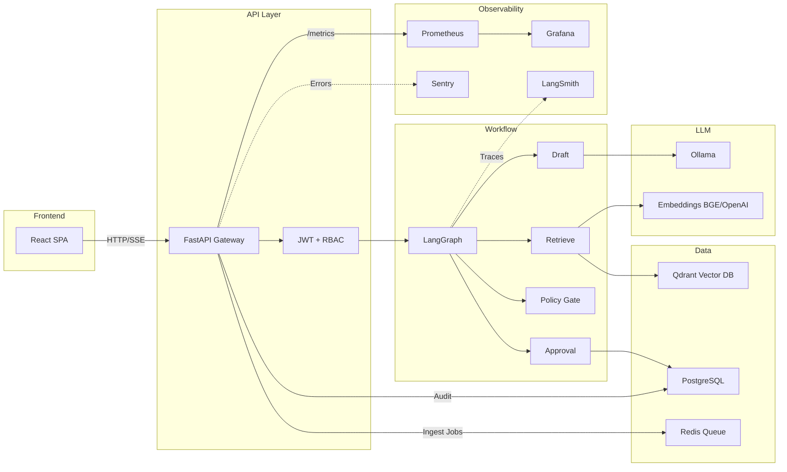

# Complyra

[](https://github.com/complyra/complyra/actions/workflows/ci.yml)
[](https://www.python.org/downloads/)
[](LICENSE)

**Production-grade enterprise RAG assistant with governed AI responses.**

Complyra combines multi-tenant retrieval-augmented generation, human-in-the-loop approval workflow, RBAC, full audit logging, and cloud-ready deployment automation — built for compliance-sensitive environments.

## Architecture



## Features

- **Multi-tenant RAG** — tenant-scoped document ingestion and retrieval via `X-Tenant-ID`
- **Human-in-the-loop approval** — LangGraph workflow with configurable approval gates
- **Pluggable embeddings** — SentenceTransformer (BGE) or OpenAI API, switchable via config
- **SSE streaming** — real-time token-by-token chat via `POST /chat/stream`
- **RBAC** — three roles: `admin`, `auditor`, `user`
- **Output policy guard** — regex-based detection of secrets, API keys, and credentials
- **Audit trail** — full event logging with search and CSV export
- **Async ingestion** — Redis + RQ worker for background document processing
- **LangSmith tracing** — optional LLM observability with zero code overhead
- **Observability** — Prometheus metrics, Grafana dashboards, Sentry error tracking

## Quick Start

### Docker Compose (recommended)

```bash
git clone https://github.com/complyra/complyra.git
cd complyra
cp .env.example .env
docker compose up --build -d
```

| Service      | URL                                      |
|-------------|------------------------------------------|
| Web UI      | http://localhost:5173                     |
| API Docs    | http://localhost:8000/docs                |
| Health      | http://localhost:8000/api/health/live     |
| Prometheus  | http://localhost:9090                     |
| Grafana     | http://localhost:3000                     |

Default credentials: `demo` / `demo123`

### Local Development

```bash
# Backend
python3 -m venv .venv && source .venv/bin/activate
pip install -r requirements-dev.txt
cp .env.example .env
alembic upgrade head
uvicorn app.main:app --host 0.0.0.0 --port 8000 --reload

# Frontend
cd web && npm install && npm run dev
```

## Configuration

All settings use the `APP_` prefix. See [`.env.example`](.env.example) for the full list.

| Variable | Default | Description |
|----------|---------|-------------|
| `APP_EMBEDDING_PROVIDER` | `sentence-transformers` | `sentence-transformers` or `openai` |
| `APP_EMBEDDING_MODEL` | `BAAI/bge-small-en-v1.5` | Local SentenceTransformer model name |
| `APP_OPENAI_API_KEY` | *(empty)* | Required when `embedding_provider=openai` |
| `APP_OPENAI_EMBEDDING_MODEL` | `text-embedding-3-small` | OpenAI model for embeddings |
| `APP_EMBEDDING_DIMENSION` | `384` | Vector dimension (384 for BGE, 1536 for OpenAI) |
| `APP_OLLAMA_MODEL` | `qwen2.5:3b-instruct` | Ollama LLM model |
| `APP_REQUIRE_APPROVAL` | `true` | Enable human-in-the-loop approval |
| `APP_OUTPUT_POLICY_ENABLED` | `true` | Enable output policy checks |
| `APP_LANGSMITH_TRACING` | `false` | Enable LangSmith tracing |
| `APP_LANGSMITH_API_KEY` | *(empty)* | LangSmith API key |
| `APP_DATABASE_URL` | `sqlite:///./data/app.db` | Database connection string |

## API Endpoints

| Method | Path | Description |
|--------|------|-------------|
| `POST` | `/api/auth/login` | Authenticate and get JWT |
| `POST` | `/api/auth/logout` | Invalidate session |
| `POST` | `/api/chat/` | Synchronous chat (JSON response) |
| `POST` | `/api/chat/stream` | Streaming chat (SSE) |
| `POST` | `/api/ingest/file` | Upload document for ingestion |
| `GET`  | `/api/ingest/jobs/{id}` | Check ingestion job status |
| `GET`  | `/api/approvals/` | List approval requests |
| `POST` | `/api/approvals/{id}/decision` | Approve/reject an answer |
| `GET`  | `/api/audit/` | Query audit logs |
| `GET`  | `/api/tenants/` | List tenants |
| `GET`  | `/api/users/` | List users |
| `GET`  | `/api/health/live` | Liveness probe |
| `GET`  | `/api/health/ready` | Readiness probe |

See [`docs/streaming-api.md`](docs/streaming-api.md) for the SSE streaming protocol.

## Testing

```bash
pip install -r requirements-dev.txt
PYTHONPATH=. pytest tests/ -v --cov=app --cov-report=term-missing
```

## Linting & Formatting

```bash
black --check app/
isort --check app/
ruff check app/
```

## Deployment (AWS)

1. Create and secure AWS account ([`docs/aws-account-onboarding.md`](docs/aws-account-onboarding.md))
2. Prepare production env (`./scripts/aws/00_preflight.sh`)
3. Terraform plan + policy gate (`./scripts/aws/07_terraform_plan.sh`)
4. Build/push images (`./scripts/aws/03_build_and_push.sh`)
5. Deploy services (`./scripts/aws/09_deploy_services_from_release.sh`)
6. Run smoke tests (`./scripts/aws/05_smoke_test.sh`)

Full runbook: [`docs/aws-deployment.md`](docs/aws-deployment.md)

## Tech Stack

| Component | Technology | Version |
|-----------|-----------|---------|
| Backend | FastAPI + Uvicorn | 0.115.8 |
| Workflow | LangGraph | 0.2.55 |
| Database | PostgreSQL + SQLAlchemy | 16 / 2.0 |
| Vector DB | Qdrant | 1.12.6 |
| Queue | Redis + RQ | 7 / 1.16 |
| LLM | Ollama | latest |
| Embeddings | SentenceTransformers / OpenAI | 3.4.1 / 1.0+ |
| Frontend | React + TypeScript + Vite | 18 / 5.x |
| Observability | Prometheus + Grafana + LangSmith | - |
| IaC | Terraform + OPA/Conftest | 1.9.x |

## Contributing

See [CONTRIBUTING.md](CONTRIBUTING.md).

## Security

See [SECURITY.md](SECURITY.md).

## License

[MIT](LICENSE)
