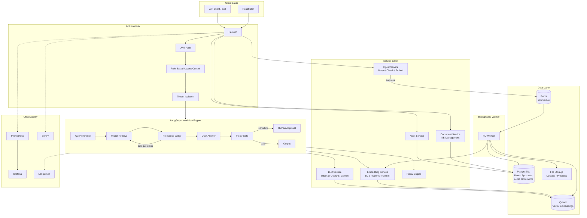
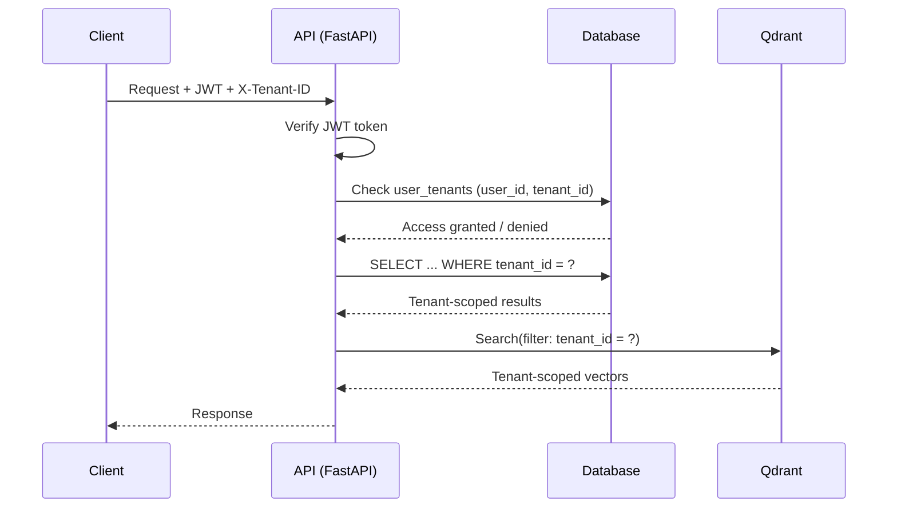
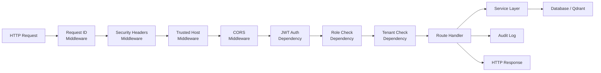
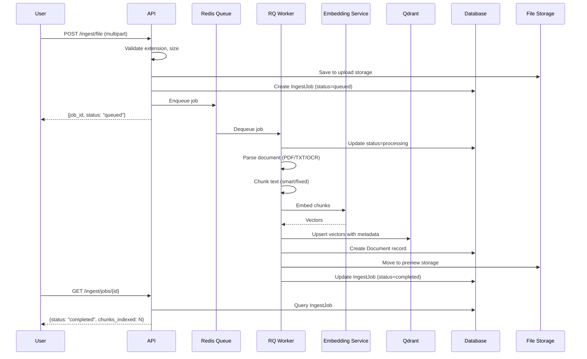
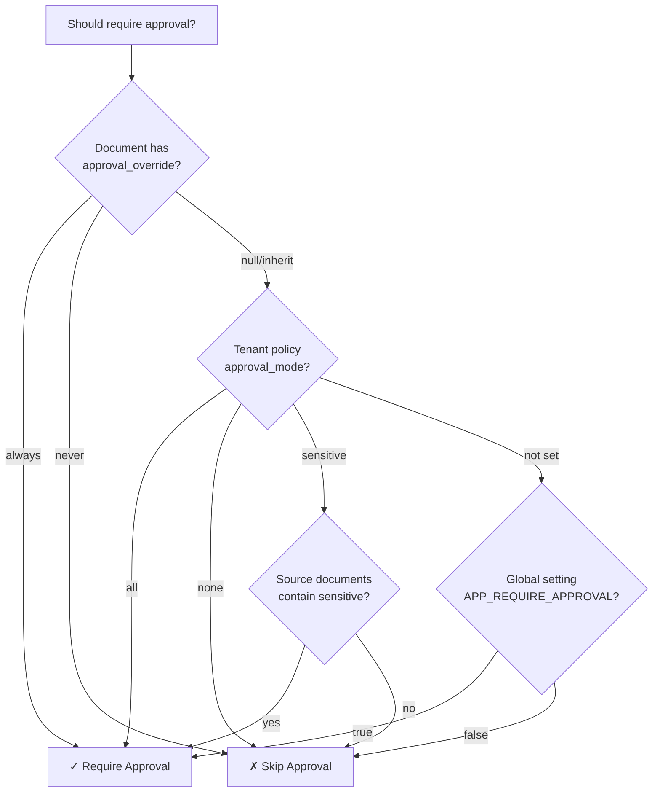

# Architecture

## 1. System Overview

Complyra is a multi-tenant enterprise RAG (Retrieval-Augmented Generation) system designed for compliance-sensitive environments. It combines vector search, LLM generation, human-in-the-loop approval, and full audit logging into a single deployable platform.



## 2. Design Principles

| Principle | Implementation |
|-----------|---------------|
| **Multi-tenancy** | Every data access scoped by `tenant_id` at API, SQL, and vector DB layers |
| **Separation of concerns** | Routes → Services → DB layers with clear boundaries |
| **Pluggable providers** | Embedding and LLM providers are interchangeable via config |
| **Human-in-the-loop** | Configurable approval gates at document, tenant, and global levels |
| **Auditability** | Every action logged with user, tenant, timestamp, and full I/O |
| **Observable** | Prometheus metrics, LangSmith traces, Sentry errors |
| **Cloud-native** | Docker containers, ECS Fargate, Terraform IaC |

## 3. Layered Backend Design

```
┌─────────────────────────────────────────────────────────┐
│  app/api/routes/    HTTP handlers and request validation │
├─────────────────────────────────────────────────────────┤
│  app/api/deps.py    Auth, tenant scoping, role guards   │
├─────────────────────────────────────────────────────────┤
│  app/services/      Domain logic and business rules     │
├─────────────────────────────────────────────────────────┤
│  app/db/            Persistence (SQLAlchemy + Qdrant)   │
├─────────────────────────────────────────────────────────┤
│  app/models/        Pydantic schemas (API contracts)    │
├─────────────────────────────────────────────────────────┤
│  app/core/          Config, security, logging, metrics  │
└─────────────────────────────────────────────────────────┘
```

**Why this matters**: Each layer has a single responsibility. Routes handle HTTP concerns, services contain business logic, and DB handles persistence. This makes testing straightforward — services can be tested without HTTP, and DB operations can be tested without business logic.

## 4. Multi-Tenant Data Isolation



Key isolation points:
- **API layer**: `get_tenant_id()` dependency verifies the user has access to the requested tenant
- **Database**: Every query includes `WHERE tenant_id = :tenant_id`
- **Qdrant**: Payload filter `{"must": [{"key": "tenant_id", "match": {"value": tenant_id}}]}`

## 5. Request Processing Pipeline



## 6. Document Ingestion Pipeline



## 7. Approval Policy Resolution

The approval decision follows a priority chain, evaluated from most specific to least:



## 8. Scalability Path

| Component | Current | Scale Strategy |
|-----------|---------|---------------|
| API | Single container | Horizontal (ECS auto-scaling behind ALB) |
| Worker | Single container | Horizontal (scale by Redis queue depth) |
| PostgreSQL | Single instance | Managed RDS with read replicas |
| Redis | Single instance | ElastiCache with failover |
| Qdrant | Single instance | Vertical → distributed (sharding) |
| LLM | Ollama (local) | Switch to API providers (OpenAI/Gemini) for elastic scale |
| Embeddings | Local SentenceTransformer | Switch to API providers or GPU instances |

## 9. Non-Goals

This repository intentionally does not include:

- SSO/SAML/OIDC enterprise identity integration
- Full DLP (Data Loss Prevention) pipeline
- Multi-region active-active replication
- Complex ABAC/PBAC policy engine
- Legal document retention lifecycle management

These are expected next-stage enhancements after production adoption.
