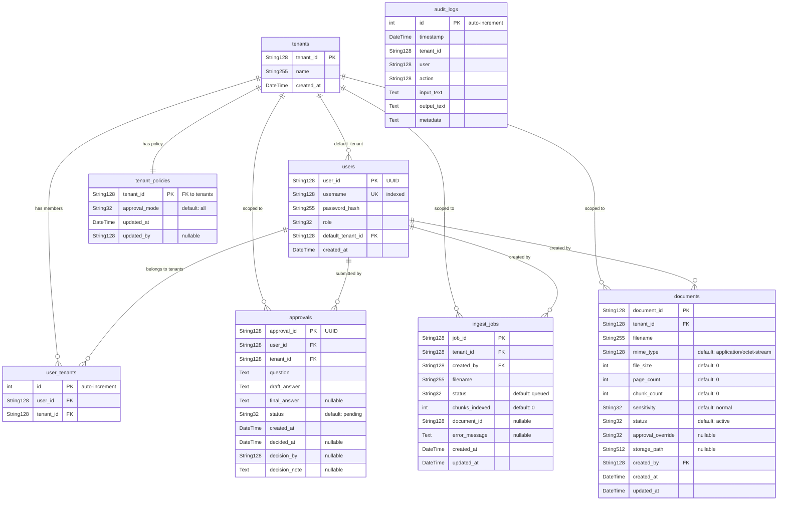

# Database Schema Documentation

This document describes the relational database schema used by Complyra. All models are defined with SQLAlchemy ORM and managed via Alembic migrations.

## Entity-Relationship Diagram



## Table Descriptions

### `tenants`

The root entity for multi-tenant isolation. Every tenant represents an independent organization. All business data is scoped to a tenant, ensuring complete data separation.

| Column | Type | Constraints | Description |
|--------|------|-------------|-------------|
| `tenant_id` | String(128) | PRIMARY KEY | Organization identifier (e.g., `acme-corp`) |
| `name` | String(255) | NOT NULL | Human-readable organization name |
| `created_at` | DateTime | NOT NULL | Timestamp of tenant creation |

### `users`

Stores user credentials and role assignments. Each user has a default tenant but may belong to multiple tenants via the `user_tenants` junction table.

| Column | Type | Constraints | Description |
|--------|------|-------------|-------------|
| `user_id` | String(128) | PRIMARY KEY | UUID-based unique identifier |
| `username` | String(128) | UNIQUE, INDEXED | Login username |
| `password_hash` | String(255) | NOT NULL | Bcrypt/argon2 hashed password |
| `role` | String(32) | NOT NULL | Role assignment (`admin`, `reviewer`, `user`, etc.) |
| `default_tenant_id` | String(128) | FK → `tenants.tenant_id` | Tenant loaded on login |
| `created_at` | DateTime | NOT NULL | Account creation timestamp |

### `user_tenants`

Junction table implementing the many-to-many relationship between users and tenants. A user can access multiple tenants, and a tenant can have multiple users.

| Column | Type | Constraints | Description |
|--------|------|-------------|-------------|
| `id` | Integer | PRIMARY KEY, AUTO-INCREMENT | Surrogate key |
| `user_id` | String(128) | FK → `users.user_id` (CASCADE) | User reference |
| `tenant_id` | String(128) | FK → `tenants.tenant_id` (CASCADE) | Tenant reference |

**Constraints:** `UniqueConstraint(user_id, tenant_id)` prevents duplicate memberships. Both foreign key columns are independently indexed for fast lookups in either direction.

### `approvals`

Tracks the human-in-the-loop approval workflow. When the system generates an answer, it is stored as `draft_answer` with status `pending`. A reviewer can approve, reject, or modify it, promoting the result to `final_answer`.

| Column | Type | Constraints | Description |
|--------|------|-------------|-------------|
| `approval_id` | String(128) | PRIMARY KEY | UUID-based identifier |
| `user_id` | String(128) | FK → `users.user_id` | User who submitted the question |
| `tenant_id` | String(128) | FK → `tenants.tenant_id` | Tenant scope |
| `question` | Text | NOT NULL | Original user question |
| `draft_answer` | Text | NOT NULL | AI-generated draft response |
| `final_answer` | Text | NULLABLE | Approved/edited final response |
| `status` | String(32) | DEFAULT `"pending"` | Workflow state: `pending`, `approved`, `rejected` |
| `created_at` | DateTime | NOT NULL | Submission timestamp |
| `decided_at` | DateTime | NULLABLE | Timestamp of approval/rejection |
| `decision_by` | String(128) | NULLABLE | Username or ID of the reviewer |
| `decision_note` | Text | NULLABLE | Reviewer's comment or rationale |

### `audit_logs`

Append-only log of all significant system actions. Used for compliance reporting, debugging, and forensic analysis. Not foreign-keyed to other tables to ensure logs survive even if referenced entities are removed.

| Column | Type | Constraints | Description |
|--------|------|-------------|-------------|
| `id` | Integer | PRIMARY KEY, AUTO-INCREMENT | Surrogate key |
| `timestamp` | DateTime | NOT NULL | Event timestamp |
| `tenant_id` | String(128) | NOT NULL | Tenant context |
| `user` | String(128) | NOT NULL | Acting user identifier |
| `action` | String(128) | NOT NULL | Action type (e.g., `query`, `approve`, `ingest`) |
| `input_text` | Text | NOT NULL | Input that triggered the action |
| `output_text` | Text | NOT NULL | System output or result |
| `metadata` | Text | NOT NULL | JSON-encoded supplementary data (column name: `metadata`) |

### `ingest_jobs`

Tracks document ingestion pipeline jobs. Each job represents a single file being processed — parsed, chunked, embedded, and indexed into the vector store.

| Column | Type | Constraints | Description |
|--------|------|-------------|-------------|
| `job_id` | String(128) | PRIMARY KEY | Job identifier |
| `tenant_id` | String(128) | FK → `tenants.tenant_id` | Tenant scope |
| `created_by` | String(128) | FK → `users.user_id` | User who initiated the ingest |
| `filename` | String(255) | NOT NULL | Original filename |
| `status` | String(32) | DEFAULT `"queued"` | Pipeline state: `queued`, `processing`, `done`, `failed` |
| `chunks_indexed` | Integer | DEFAULT `0` | Number of chunks written to vector store |
| `document_id` | String(128) | NULLABLE | Associated document ID once created |
| `error_message` | Text | NULLABLE | Error details on failure |
| `created_at` | DateTime | NOT NULL | Job creation timestamp |
| `updated_at` | DateTime | NOT NULL | Last status update timestamp |

### `documents`

Metadata registry for ingested documents. Stores file properties, sensitivity classification, and lifecycle status. Actual file content lives in object storage; this table holds the `storage_path` reference.

| Column | Type | Constraints | Description |
|--------|------|-------------|-------------|
| `document_id` | String(128) | PRIMARY KEY | Document identifier |
| `tenant_id` | String(128) | FK → `tenants.tenant_id` | Tenant scope |
| `filename` | String(255) | NOT NULL | Original filename |
| `mime_type` | String(128) | DEFAULT `"application/octet-stream"` | MIME type of the file |
| `file_size` | Integer | DEFAULT `0` | File size in bytes |
| `page_count` | Integer | DEFAULT `0` | Number of pages (for PDFs, etc.) |
| `chunk_count` | Integer | DEFAULT `0` | Number of vector chunks generated |
| `sensitivity` | String(32) | DEFAULT `"normal"` | Data sensitivity level (`normal`, `confidential`, `restricted`) |
| `status` | String(32) | DEFAULT `"active"` | Lifecycle state: `active`, `archived`, `deleted` |
| `approval_override` | String(32) | NULLABLE | Per-document approval mode override |
| `storage_path` | String(512) | NULLABLE | Path or URI to the stored file (S3, local, etc.) |
| `created_by` | String(128) | FK → `users.user_id` | User who uploaded the document |
| `created_at` | DateTime | NOT NULL | Upload timestamp |
| `updated_at` | DateTime | NOT NULL | Last modification timestamp |

### `tenant_policies`

One-to-one configuration table for tenant-level policy settings. Currently governs the approval workflow mode but is designed for future policy expansion.

| Column | Type | Constraints | Description |
|--------|------|-------------|-------------|
| `tenant_id` | String(128) | PRIMARY KEY, FK → `tenants.tenant_id` | Tenant reference (1:1) |
| `approval_mode` | String(32) | DEFAULT `"all"` | Approval strategy: `all` (every answer), `sensitive` (only sensitive docs), `none` |
| `updated_at` | DateTime | NOT NULL | Last policy update timestamp |
| `updated_by` | String(128) | NULLABLE | User who last modified the policy |

## Indexes

The schema uses targeted composite and single-column indexes to optimize the most frequent query patterns.

| Table | Index Columns | Purpose |
|-------|---------------|---------|
| `users` | `username` | Fast login lookup by username |
| `user_tenants` | `user_id` | List all tenants for a user |
| `user_tenants` | `tenant_id` | List all users in a tenant |
| `approvals` | `(tenant_id, status)` | Dashboard queries: "show all pending approvals for this tenant" |
| `approvals` | `user_id` | User-specific approval history |
| `audit_logs` | `(tenant_id, timestamp)` | Time-range compliance queries scoped to a tenant |
| `audit_logs` | `action` | Filter logs by action type across tenants |
| `ingest_jobs` | `(tenant_id, created_at)` | Chronological job listing per tenant |
| `ingest_jobs` | `status` | Global job queue polling (e.g., find all `queued` jobs) |
| `documents` | `(tenant_id, status)` | List active/archived documents per tenant |
| `documents` | `(tenant_id, sensitivity)` | Filter documents by sensitivity within a tenant |

### Index Design Rationale

- **Composite indexes** place the tenant ID first because virtually every query is tenant-scoped. This allows the database to first narrow by tenant and then apply the secondary filter efficiently.
- **Single-column indexes** on fields like `status` and `action` support administrative or background queries that operate across tenants (e.g., a worker polling for queued ingest jobs).
- The `user_tenants` junction table indexes both foreign keys independently rather than using a composite index, because lookups go in both directions — "which tenants does this user belong to?" and "which users belong to this tenant?"

## Multi-Tenant Data Isolation

Complyra implements **row-level multi-tenancy** within a shared database. Every business entity table includes a `tenant_id` column that scopes data to a single organization.

### Isolation Strategy

1. **Application-layer filtering:** Every database query includes a `tenant_id` predicate. The tenant context is resolved from the authenticated user's JWT token and injected into the query layer automatically.
2. **Foreign key constraints:** Tables like `approvals`, `documents`, and `ingest_jobs` have explicit foreign keys to `tenants.tenant_id`, preventing orphaned records from being created outside a valid tenant context.
3. **Audit logs as a special case:** The `audit_logs` table stores `tenant_id` as a plain string column rather than a foreign key. This is intentional — audit logs must survive tenant deletion for compliance purposes and must never be cascade-deleted.
4. **User-tenant mapping:** The `user_tenants` junction table with cascade deletes ensures that when a tenant is removed, all user-tenant associations are cleaned up, while the user account itself is preserved.

### Tenant-Scoped Access Pattern

```
Request → JWT decode → extract tenant_id
       → Session middleware sets tenant context
       → All ORM queries filter by tenant_id
       → Response contains only tenant-scoped data
```

## Migration Strategy (Alembic)

Database schema changes are managed with [Alembic](https://alembic.sqlalchemy.org/), SQLAlchemy's migration framework.

### Workflow

1. **Modify models** in the SQLAlchemy model definitions.
2. **Auto-generate migration:**
   ```bash
   alembic revision --autogenerate -m "description of change"
   ```
3. **Review the generated migration** in `alembic/versions/`. Auto-generated migrations should always be reviewed for correctness — Alembic cannot detect all changes (e.g., renamed columns are represented as drop + add).
4. **Apply migration:**
   ```bash
   alembic upgrade head
   ```
5. **Rollback if needed:**
   ```bash
   alembic downgrade -1
   ```

### Conventions

- Migration messages use imperative mood (e.g., `"add sensitivity column to documents"`).
- Every migration must include both `upgrade()` and `downgrade()` functions.
- Data migrations (backfilling values, transforming existing rows) are kept in separate migration files from schema migrations to simplify rollback.
- In production, migrations run as a pre-deployment step before the new application version starts, ensuring the schema is always forward-compatible with the running code.

### Handling Multi-Tenant Migrations

When adding a new column with a default value or a new table, no special tenant-level handling is required — the schema is shared. However, data migrations that backfill rows must iterate tenant-by-tenant to avoid locking the entire table and to respect per-tenant data boundaries.
