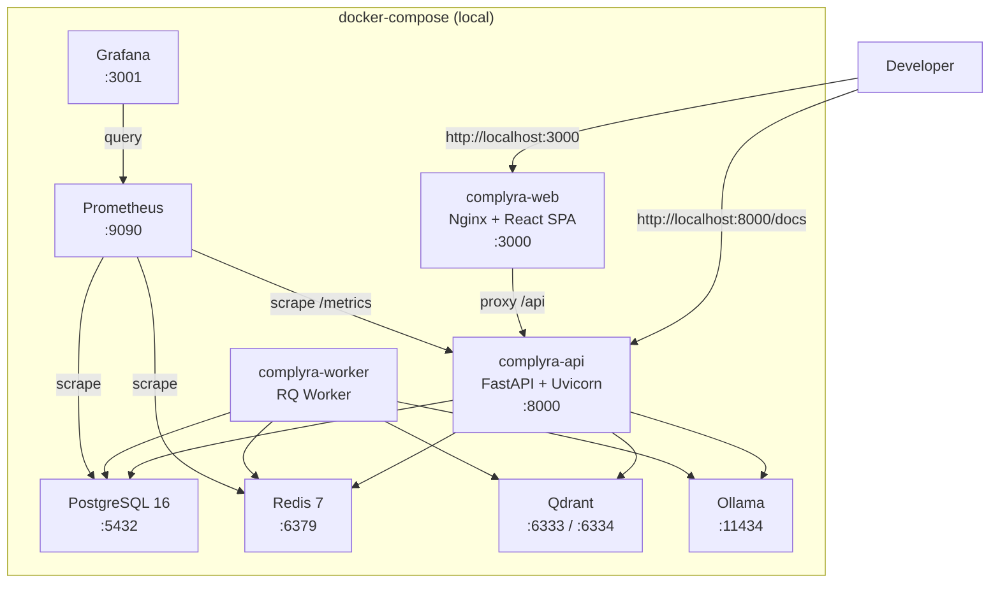
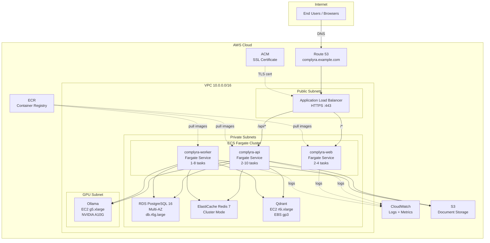
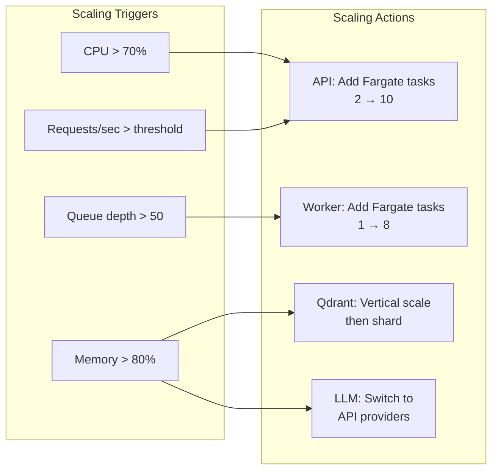
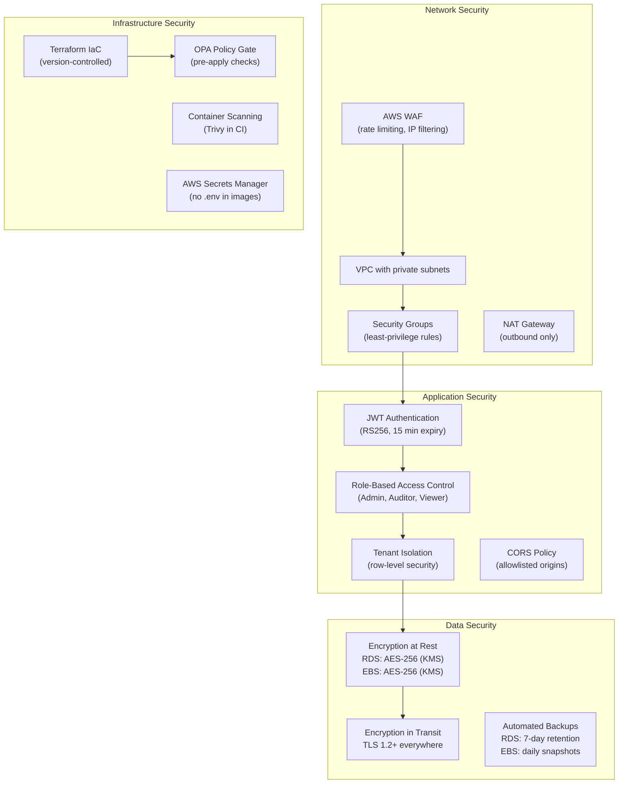
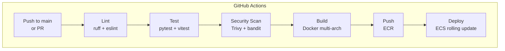
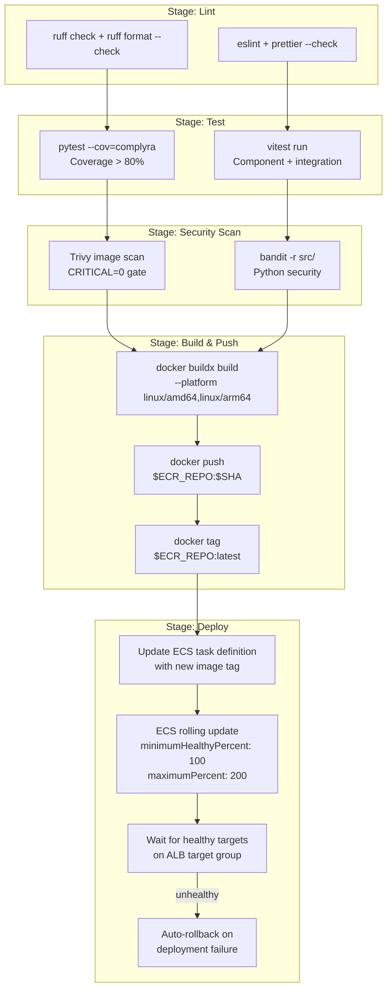
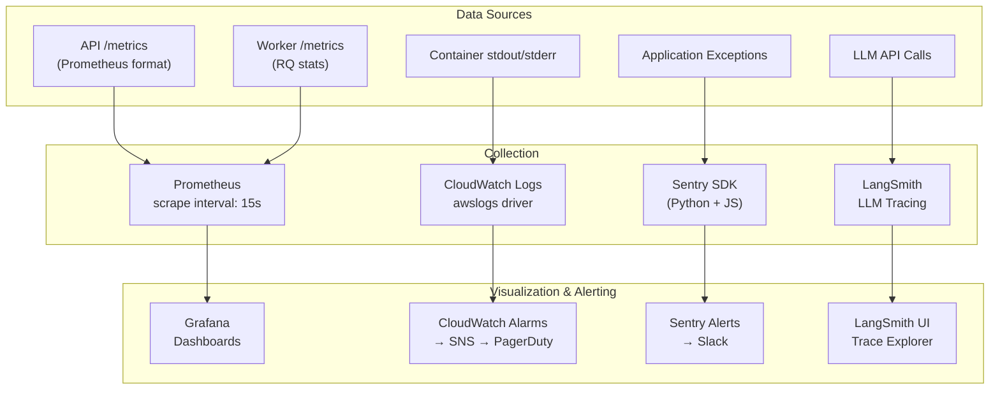

# Deployment Architecture

This document describes the full deployment architecture for Complyra, covering local development, AWS production, container design, scaling, security, CI/CD, and monitoring.

---

## 1. Local Development

All services run via `docker-compose` on the developer's machine.



### Key Points

- **Hot reload** is enabled for both the API (`--reload`) and the Web (`vite dev`) containers via bind-mounted source directories.
- PostgreSQL data and Qdrant collections are persisted in named Docker volumes.
- Ollama runs locally and pulls models on first use (`ollama pull nomic-embed-text`).
- A shared Docker network (`complyra-net`) connects all services.

---

## 2. AWS Production Architecture



### Network Layout

| Subnet Type | CIDR Range | Components |
|---|---|---|
| Public (AZ-a) | 10.0.1.0/24 | ALB, NAT Gateway |
| Public (AZ-b) | 10.0.2.0/24 | ALB, NAT Gateway |
| Private (AZ-a) | 10.0.10.0/24 | ECS tasks, RDS primary, Qdrant |
| Private (AZ-b) | 10.0.20.0/24 | ECS tasks, RDS standby, ElastiCache |
| GPU (AZ-a) | 10.0.30.0/24 | Ollama EC2 (g5.xlarge) |

### DNS & SSL

- **Route 53** manages `complyra.example.com` with an alias record pointing to the ALB.
- **ACM** provisions and auto-renews the TLS certificate attached to the ALB listener.
- HTTP :80 on the ALB redirects to HTTPS :443.

---

## 3. Container Architecture

### 3.1 API Container (`complyra-api`)

| Property | Value |
|---|---|
| Base image | `python:3.12-slim` (ARM64 / AMD64 multi-arch) |
| Runtime | FastAPI served by Uvicorn |
| Port | 8000 |
| User | `appuser` (non-root, UID 1000) |
| Healthcheck | `GET /health` every 30s |
| Resource limits | 1 vCPU, 2 GB RAM |

```dockerfile
# Simplified Dockerfile snippet
FROM python:3.12-slim AS runtime
RUN useradd -m -u 1000 appuser
COPY --from=builder /app /app
USER appuser
HEALTHCHECK --interval=30s --timeout=5s CMD curl -f http://localhost:8000/health || exit 1
CMD ["uvicorn", "complyra.main:app", "--host", "0.0.0.0", "--port", "8000"]
```

### 3.2 Worker Container (`complyra-worker`)

| Property | Value |
|---|---|
| Base image | Same as API (shared image, different entrypoint) |
| Runtime | RQ (Redis Queue) worker |
| Queues | `default`, `ingestion`, `embedding` |
| User | `appuser` (non-root) |
| Healthcheck | RQ worker heartbeat check |
| Resource limits | 1 vCPU, 4 GB RAM (embedding tasks need more memory) |

```dockerfile
# Same image, different CMD
CMD ["python", "-m", "rq.cli", "worker", \
     "--url", "redis://redis:6379/0", \
     "ingestion", "embedding", "default"]
```

The worker handles long-running tasks:
- Document parsing and chunking
- Embedding generation via Ollama or external providers
- Qdrant vector upserts
- Compliance report generation

### 3.3 Web Container (`complyra-web`)

| Property | Value |
|---|---|
| Build stage 1 | `node:20-alpine` — builds the React SPA |
| Build stage 2 | `nginx:alpine` — serves static assets |
| Port | 80 (behind ALB) |
| User | `nginx` (non-root) |
| Healthcheck | `GET /` every 30s |
| Resource limits | 0.25 vCPU, 512 MB RAM |

```dockerfile
# Multi-stage build
FROM node:20-alpine AS build
WORKDIR /app
COPY package*.json ./
RUN npm ci
COPY . .
RUN npm run build

FROM nginx:alpine
COPY --from=build /app/dist /usr/share/nginx/html
COPY nginx.conf /etc/nginx/conf.d/default.conf
HEALTHCHECK --interval=30s CMD curl -f http://localhost/ || exit 1
```

Nginx configuration handles:
- SPA fallback (`try_files $uri /index.html`)
- Gzip compression for JS/CSS/JSON
- Cache headers for hashed assets (`Cache-Control: max-age=31536000`)

---

## 4. Scaling Strategy



### 4.1 API Service

| Metric | Strategy |
|---|---|
| Scaling type | Horizontal (ECS Service Auto Scaling) |
| Min / Max tasks | 2 / 10 |
| Scale-out trigger | Average CPU > 70% for 3 minutes |
| Scale-in trigger | Average CPU < 30% for 10 minutes |
| Cooldown | 60s scale-out, 300s scale-in |

### 4.2 Worker Service

| Metric | Strategy |
|---|---|
| Scaling type | Horizontal (ECS + custom CloudWatch metric) |
| Min / Max tasks | 1 / 8 |
| Scale-out trigger | Redis queue depth > 50 messages |
| Scale-in trigger | Queue depth = 0 for 10 minutes |
| Custom metric | Lambda publishes queue depth to CloudWatch every 60s |

### 4.3 Qdrant

| Phase | Strategy |
|---|---|
| Phase 1 (< 5M vectors) | Single EC2 `r6i.xlarge` (4 vCPU, 32 GB RAM, 500 GB gp3 EBS) |
| Phase 2 (5M-50M vectors) | Vertical scale to `r6i.2xlarge`, enable mmap storage |
| Phase 3 (> 50M vectors) | Horizontal sharding across 3+ Qdrant nodes in a cluster |

### 4.4 LLM Inference

| Phase | Strategy |
|---|---|
| Development | Ollama on local machine (CPU) |
| Staging | Ollama on EC2 `g5.xlarge` (single A10G GPU) |
| Production (low traffic) | Ollama on EC2 `g5.2xlarge` with request queuing |
| Production (high traffic) | Switch to API providers (OpenAI GPT-4o, Google Gemini) |

A feature flag (`LLM_PROVIDER`) controls which backend is used, enabling seamless switching without redeployment:

```
LLM_PROVIDER=ollama       # self-hosted
LLM_PROVIDER=openai       # OpenAI API
LLM_PROVIDER=gemini       # Google Gemini API
```

---

## 5. Security Layers



### Security Group Rules

| Service | Inbound | Source |
|---|---|---|
| ALB | 443/tcp | 0.0.0.0/0 |
| API (Fargate) | 8000/tcp | ALB SG only |
| Web (Fargate) | 80/tcp | ALB SG only |
| RDS | 5432/tcp | API SG, Worker SG |
| ElastiCache | 6379/tcp | API SG, Worker SG |
| Qdrant | 6333-6334/tcp | API SG, Worker SG |
| Ollama | 11434/tcp | API SG, Worker SG |

### Tenant Isolation

Every database query includes a `tenant_id` filter enforced at the ORM level via SQLAlchemy session events. Qdrant collections are partitioned by tenant using payload filtering. This ensures one tenant can never access another tenant's data, even in the event of an application bug.

### Secrets Management

All secrets (database credentials, API keys, JWT signing keys) are stored in AWS Secrets Manager and injected into ECS tasks as environment variables at runtime. No secrets are baked into container images.

---

## 6. CI/CD Pipeline



### Pipeline Stages



### Blue-Green via ECS Rolling Updates

ECS performs a rolling update by:

1. Launching new tasks with the updated image (up to 200% of desired count).
2. Registering new tasks with the ALB target group.
3. Waiting for new tasks to pass health checks.
4. Draining connections from old tasks (deregistration delay: 30s).
5. Stopping old tasks.

If new tasks fail health checks, ECS automatically rolls back to the previous task definition via the ECS deployment circuit breaker.

### Environment Promotion

```
feature-branch → PR → main → staging (auto) → production (manual approval)
```

| Environment | Trigger | Infrastructure |
|---|---|---|
| Staging | Push to `main` | Separate ECS cluster, shared RDS (different DB) |
| Production | Manual approval in GitHub Actions | Dedicated ECS cluster, dedicated RDS |

---

## 7. Monitoring Stack



### 7.1 Prometheus Metrics

Custom application metrics exposed at `GET /metrics`:

| Metric | Type | Description |
|---|---|---|
| `complyra_http_requests_total` | Counter | Total HTTP requests by method, path, status |
| `complyra_http_request_duration_seconds` | Histogram | Request latency distribution |
| `complyra_documents_ingested_total` | Counter | Documents processed by the ingestion pipeline |
| `complyra_embedding_duration_seconds` | Histogram | Time to generate embeddings for a document |
| `complyra_qdrant_search_duration_seconds` | Histogram | Vector search latency |
| `complyra_llm_request_duration_seconds` | Histogram | LLM inference latency by provider |
| `complyra_llm_tokens_total` | Counter | Token usage by provider and direction (input/output) |
| `complyra_rq_queue_depth` | Gauge | Current number of jobs in each RQ queue |
| `complyra_active_tenants` | Gauge | Number of tenants with activity in the last hour |

### 7.2 Grafana Dashboards

| Dashboard | Panels |
|---|---|
| **API Overview** | Request rate, error rate (5xx), p50/p95/p99 latency, active connections |
| **Worker Overview** | Queue depth, job throughput, job failure rate, processing time |
| **LLM Performance** | Requests/sec by provider, latency by provider, token usage, cost estimate |
| **Infrastructure** | CPU/memory per ECS task, RDS connections, Redis memory, Qdrant segment count |
| **Business Metrics** | Documents ingested/day, searches/day, active tenants, compliance checks |

### 7.3 Sentry Error Tracking

- **Python SDK** in the API and Worker services captures unhandled exceptions with full stack traces, request context, and user/tenant info.
- **JavaScript SDK** in the React frontend captures client-side errors, performance transactions, and session replays.
- Alert rules notify Slack on new issues or regressions.

### 7.4 LangSmith LLM Tracing

Every LLM call is traced via LangSmith, capturing:

- Input prompt and output completion
- Token counts and latency
- Model name and provider
- Retrieval context (which chunks were used)
- User feedback (thumbs up/down on answers)

This enables debugging of RAG quality issues and cost optimization by analyzing which queries consume the most tokens.

### 7.5 CloudWatch Container Logs

All ECS tasks use the `awslogs` log driver, streaming stdout/stderr to CloudWatch Log Groups:

```
/ecs/complyra-api
/ecs/complyra-web
/ecs/complyra-worker
```

Log retention is set to 30 days. CloudWatch Logs Insights is used for ad-hoc queries. Critical log patterns (e.g., `CRITICAL`, `OOMKilled`) trigger CloudWatch Alarms routed to PagerDuty via SNS.

---

## Summary

| Concern | Local | Production |
|---|---|---|
| Orchestration | docker-compose | ECS Fargate |
| Database | PostgreSQL container | RDS Multi-AZ |
| Cache | Redis container | ElastiCache |
| Vector DB | Qdrant container | Qdrant on EC2 |
| LLM | Ollama (CPU) | Ollama (GPU) or API providers |
| Load Balancing | Nginx (in web container) | ALB with HTTPS |
| Monitoring | Prometheus + Grafana | Prometheus + Grafana + Sentry + LangSmith + CloudWatch |
| CI/CD | N/A | GitHub Actions with ECS rolling deploy |
| IaC | docker-compose.yml | Terraform + OPA |
