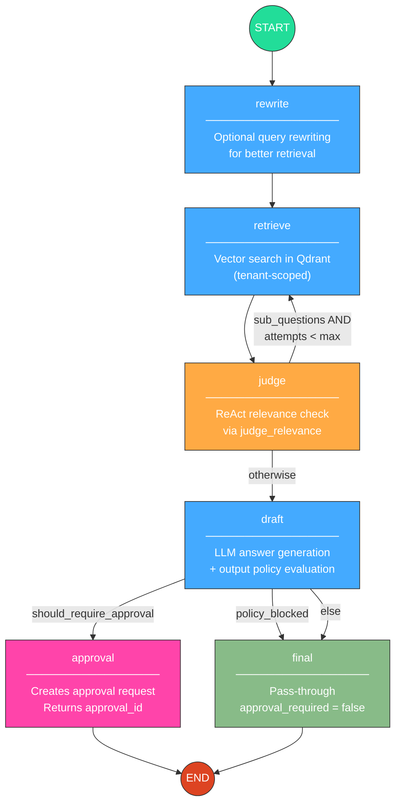
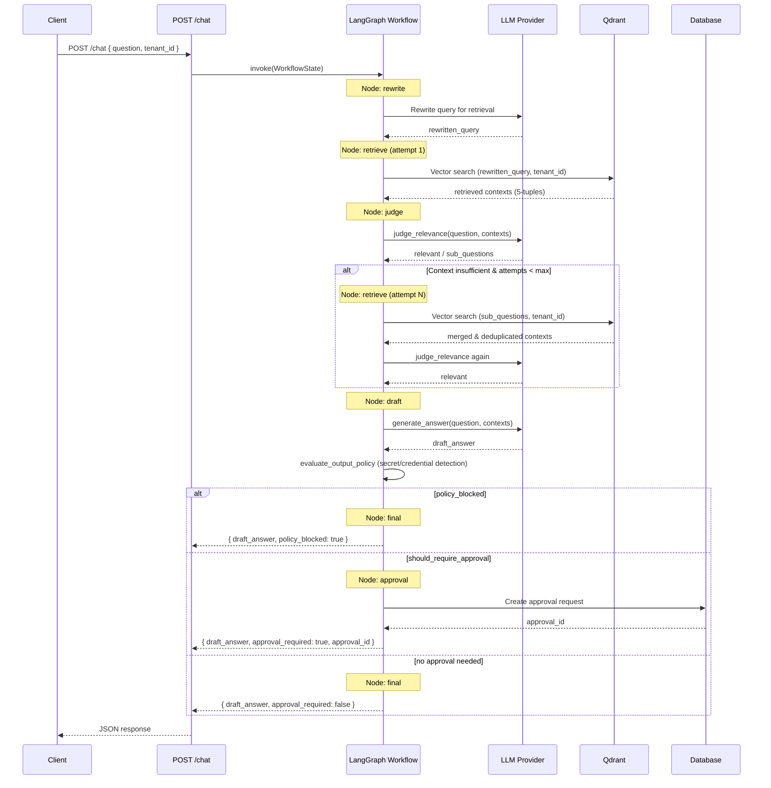

# LangGraph Workflow Design

This document describes the RAG (Retrieval-Augmented Generation) workflow implemented with LangGraph, including its nodes, edges, state management, ReAct retrieval loop, approval policy resolution, and SSE streaming variant.

---

## 1. Workflow Flowchart



---

## 2. Chat Request Sequence Diagram



---

## 3. Node Descriptions

### 3.1 `rewrite`

Optionally rewrites the user's original question into a form better suited for vector retrieval. This node is async and uses a `ThreadPoolExecutor` when an event loop is already running. The rewritten query is stored in `state.rewritten_query`.

### 3.2 `retrieve`

Performs vector similarity search in Qdrant, scoped to the user's `tenant_id`.

- **First attempt:** searches using `rewritten_query`.
- **Subsequent attempts:** searches each entry in `sub_questions`, then merges results with the existing `all_contexts` list, deduplicating by `document_id` and chunk identity.

Results are stored as a list of 5-tuples: `(text, score, source, page_numbers, document_id)`.

### 3.3 `judge`

ReAct-style relevance check. Calls `judge_relevance` asynchronously to determine whether the retrieved context is sufficient to answer the question.

- If sufficient, the workflow proceeds to `draft`.
- If insufficient, the judge returns `sub_questions`—reformulated queries designed to fill knowledge gaps—and the workflow loops back to `retrieve`.
- The judge is **skipped** (proceeds directly to `draft`) when:
  - `react_retrieval_enabled` is `false`, or
  - `retrieval_attempts` has reached `max_attempts`.

### 3.4 `draft`

Two-phase node:

1. **Answer generation:** Calls `generate_answer` with the question and all retrieved contexts to produce `draft_answer`.
2. **Output policy evaluation:** Runs `evaluate_output_policy` to scan the draft for secret/credential patterns (API keys, passwords, tokens, etc.). If violations are found, `policy_blocked` is set to `true` and `policy_violations` is populated.

### 3.5 `approval`

Creates an approval request record in the database and returns an `approval_id`. The response signals to the client that the answer requires human review before it can be shown or acted upon.

### 3.6 `final`

A pass-through node that marks `approval_required = false`. This is the terminal node for answers that either passed policy checks without needing approval, or were policy-blocked (in which case the answer is returned with the block reason).

---

## 4. ReAct Retrieval Loop

The `judge` and `retrieve` nodes form a ReAct (Reasoning + Acting) loop that iteratively improves context quality:

```
retrieve → judge → [insufficient?] → retrieve → judge → ... → draft
```

**How it works:**

1. After the first retrieval, the judge evaluates whether the retrieved chunks collectively contain enough information to answer the original question.
2. If not, the judge reasons about what information is missing and generates `sub_questions`—targeted queries designed to surface the missing content.
3. The workflow loops back to `retrieve`, which searches for each sub-question independently. New results are merged with previously retrieved contexts, and duplicates are removed.
4. The judge evaluates the expanded context set again.
5. This loop continues until either:
   - The judge determines the context is **sufficient**, or
   - `retrieval_attempts` reaches **max_attempts** (a configurable ceiling that prevents infinite loops).

When `react_retrieval_enabled` is set to `false`, the judge node is bypassed entirely, and the workflow proceeds directly from the first retrieval to drafting. This is useful for low-latency scenarios where a single retrieval pass is acceptable.

---

## 5. Approval Policy Resolution Chain

The `route_after_draft` conditional edge determines what happens after the `draft` node. It implements a priority-based policy resolution chain:

```
policy_blocked? ──yes──► final (blocked answer returned with violations)
       │
       no
       ▼
document override? ──"always"──► approval
       │                ──"never"──► final
       │
    no override
       ▼
tenant policy? ──"all"──────────► approval
       │         ──"sensitive"──► approval (if content is sensitive)
       │         ──"none"───────► final
       │
    no tenant policy
       ▼
global settings.require_approval? ──true──► approval
       │                           ──false─► final
       ▼
      final
```

### Priority order (highest to lowest):

| Priority | Source              | Possible Values         | Behavior                                                |
|----------|---------------------|-------------------------|---------------------------------------------------------|
| 1        | Output policy       | blocked / not blocked   | If `policy_blocked`, route to `final` immediately       |
| 2        | Document override   | `always` / `never`      | Per-document setting that overrides all tenant/global    |
| 3        | Tenant policy       | `all` / `sensitive` / `none` | Tenant-level approval requirement                  |
| 4        | Global settings     | `require_approval` bool | System-wide default when no higher-priority rule applies |

---

## 6. State Transitions Table

| Field                | Set By     | Type                          | Description                                                        |
|----------------------|------------|-------------------------------|--------------------------------------------------------------------|
| `question`           | Input      | `str`                         | Original user question                                             |
| `tenant_id`          | Input      | `str`                         | Tenant scope for retrieval and policy                              |
| `user_id`            | Input      | `str`                         | Requesting user identifier                                         |
| `rewritten_query`    | `rewrite`  | `str`                         | Query rewritten for better retrieval performance                   |
| `retrieved`          | `retrieve` | `list[tuple[str, float, str, list[int], str]]` | Retrieved chunks as 5-tuples: (text, score, source, page_numbers, document_id) |
| `all_contexts`       | `retrieve` | `list`                        | Accumulated contexts across all retrieval attempts (deduplicated)  |
| `retrieval_attempts` | `retrieve` | `int`                         | Number of retrieval passes executed so far                         |
| `sub_questions`      | `judge`    | `list[str]`                   | Sub-questions generated when context is insufficient               |
| `draft_answer`       | `draft`    | `str`                         | Generated answer text                                              |
| `policy_blocked`     | `draft`    | `bool`                        | Whether the answer was blocked by output policy                    |
| `policy_violations`  | `draft`    | `list[str]`                   | List of detected policy violations (e.g., exposed secrets)         |
| `source_document_ids`| `draft`    | `list[str]`                   | IDs of documents used to generate the answer                       |
| `approval_required`  | `approval` / `final` | `bool`               | Whether human approval is required for this answer                 |
| `approval_id`        | `approval` | `str`                         | ID of the created approval request (set only when approval needed) |

### State lifecycle across a typical request:

```
START
  question, tenant_id, user_id ← input
  ↓
rewrite
  rewritten_query ← LLM output
  ↓
retrieve (attempt 1)
  retrieved ← Qdrant results
  all_contexts ← retrieved (initial)
  retrieval_attempts ← 1
  ↓
judge
  sub_questions ← LLM output (if context insufficient)
  ↓
retrieve (attempt 2, if looping)
  retrieved ← new Qdrant results
  all_contexts ← merged + deduplicated
  retrieval_attempts ← 2
  ↓
judge (pass)
  sub_questions ← cleared
  ↓
draft
  draft_answer ← LLM output
  policy_blocked ← evaluate_output_policy result
  policy_violations ← detected patterns
  source_document_ids ← extracted from all_contexts
  ↓
final OR approval
  approval_required ← true/false
  approval_id ← DB record ID (approval node only)
  ↓
END
```

---

## 7. SSE Streaming Variant

The `POST /chat/stream` endpoint executes the same LangGraph workflow but streams results to the client using **Server-Sent Events (SSE)**.

### Differences from `POST /chat`:

| Aspect           | `POST /chat`                    | `POST /chat/stream`                         |
|------------------|---------------------------------|----------------------------------------------|
| Response format  | Single JSON response            | SSE event stream (`text/event-stream`)       |
| Token delivery   | All tokens returned at once     | Tokens streamed as they are generated        |
| Draft node       | `generate_answer` returns full  | `generate_answer` yields token-by-token      |
| Other nodes      | Same logic                      | Same logic (non-streaming nodes emit status) |
| Client handling  | Parse JSON body                 | EventSource / SSE client                     |

### SSE Event Types:

The stream emits events at each workflow stage, allowing the client to show real-time progress:

```
event: status
data: {"node": "rewrite", "status": "running"}

event: status
data: {"node": "retrieve", "status": "running", "attempt": 1}

event: status
data: {"node": "judge", "status": "running"}

event: token
data: {"content": "Based on"}

event: token
data: {"content": " the document"}

event: token
data: {"content": "..."}

event: result
data: {"draft_answer": "...", "approval_required": false, "source_document_ids": [...]}

event: done
data: {}
```

The `token` events are emitted only during the `draft` node when the LLM streams its response. All other nodes emit `status` events to keep the client informed of progress. The final `result` event contains the complete workflow output, identical in structure to the `POST /chat` response body.
